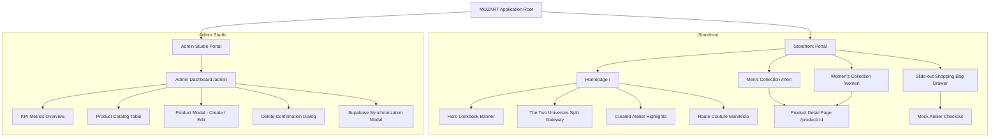

# Dokumen Desain Teknis & UI/UX — MOZART Haute Couture

---

## 1. Ikhtisar & Visi Desain

### 1.1 Profil Brand & Filosofi Visual
**MOZART** adalah sebuah platform e-commerce fashion mewah (*haute couture*) dengan pendekatan desain minimalis editorial. Mengambil inspirasi dari rumah mode legendaris dunia seperti **Louis Vuitton, Chanel, Gucci, Prada, dan The Row**, estetika MOZART mengedepankan prinsip:
- **Quiet Luxury & Architectural Minimalism**: Struktur bersih tanpa ornamen berlebih, memanfaatkan *whitespace* (ruang kosong) yang lapang untuk memberi panggung utama pada fotografi produk resolusi tinggi.
- **Editorial Typography**: Menggabungkan keanggunan tipografi serif bergaya majalah mode Eropa (*Italiana* dan *Cormorant Garamond*) dengan ketajaman sans-serif modern (*Plus Jakarta Sans*).
- **Monochromatic Sophistication**: Skema warna monokromatik berbasis hitam obsidian pekat, putih murni, dan aksen *warm alabaster/parchment*, dipertegas dengan garis batas *hairline* 1px yang sangat halus.
- **Desktop-First Optimization**: Dirancang khusus untuk pengalaman layar lebar (1280px hingga 1920px), memaksimalkan tata letak *split-screen*, rasio foto editorial potret (3:4), dan *sticky sidebars*.

### 1.2 Cakupan Sistem (Dual Portal)
Aplikasi terbagi menjadi dua portal terpadu:
1. **Customer Storefront (`/`, `/men`, `/women`, `/product/[id]`)**: Etalase belanja mewah untuk pelanggan global (berbahasa Inggris).
2. **Admin Curation Studio (`/admin`)**: Panel kendali manajemen katalog produk (CRUD: *Create, Read, Update, Delete*) dengan integrasi cloud database **Supabase**.

### 1.3 Tech Stack & Infrastruktur
- **Framework**: Next.js (App Router, Turbopack, React, TypeScript).
- **Styling**: Tailwind CSS dengan custom design tokens, micro-transitions, dan webkit scrollbar kustom.
- **Iconography**: Lucide React (stroke width tipis: 1.25–1.5).
- **Database & Backend**: **Supabase** (Proyek *"fashion store"* di `https://kafchlvjbbauchwuehyt.supabase.co`) dengan fallback lokal yang *resilient*.
- **State Management**: React Context API (`ProductContext` dan `CartContext`) dengan persistensi `localStorage`.

---

## 2. Design System & Design Tokens

### 2.1 Sistem Palet Warna (Color Tokens)

| Token Desain | Kode HEX | Nilai RGB/Opacity | Peruntukan & Penerapan |
|---|---|---|---|
| `color.obsidian` (Primary) | `#09090b` | `rgb(9, 9, 11)` | Background gelap, teks headline utama, tombol CTA primer, border gelap |
| `color.pure-black` | `#000000` | `rgb(0, 0, 0)` | Aksen hero background, bayangan kontras tinggi |
| `color.alabaster` (Canvas) | `#fafaf8` | `rgb(250, 250, 248)` | Background utama halaman storefront dan admin card |
| `color.pure-white` | `#ffffff` | `rgb(255, 255, 255)` | Input fields, kartu produk pop-out, teks di atas surface hitam |
| `color.canvas-subtle` | `#f4f3ee` | `rgb(244, 243, 238)` | Background header tabel, drawer footer, secondary containers |
| `color.stone-light` | `#edeae4` | `rgb(237, 234, 228)` | Placeholder image background, aspect-ratio frame |
| `color.hairline-border` | — | `rgba(0, 0, 0, 0.08)` | Garis pemisah ultra-tipis pada navbar, footer, dan kartu produk |
| `color.hairline-dark` | — | `rgba(255, 255, 255, 0.12)`| Garis pemisah pada seksi gelap (hero, manifesto, dark footer) |
| `color.text-muted` | `#71717a` | `rgb(113, 113, 122)` | Sub-judul, metadata, label pendukung, deskripsi sekunder |
| `color.status-success` | `#10b981` | `rgb(16, 185, 129)` | Indikator live Supabase connection, konfirmasi add to cart |
| `color.status-warning` | `#f59e0b` | `rgb(245, 158, 11)` | Indikator local fallback mode |
| `color.status-danger` | `#b91c1c` | `rgb(185, 28, 28)` | Tombol de-list produk, pesan error form |

---

### 2.2 Sistem Tipografi

Font stack menggabungkan tiga tingkatan tipografi:
1. **Editorial Display Serif**: `Italiana`, `Cormorant Garamond`, Georgia, serif.
2. **Body & Interface Sans**: `Plus Jakarta Sans`, system-ui, -apple-system, sans-serif.
3. **Monospace Metadata**: `font-mono`, monospace (untuk SKU, kode referensi produk, dan ID).

| Token Tipografi | Font Family | Size | Weight | Tracking / Letter Spacing | Penerapan |
|---|---|---|---|---|---|
| `type.brandmark` | Italiana | 36px | 400 | `0.35em` (Wide) | Logo wordmark **"M O Z A R T"** |
| `type.hero-title` | Italiana | 72px–88px | 400 | `0.10em` | Judul utama Hero Banner di Homepage |
| `type.section-title`| Italiana | 36px–40px | 400 | `0.15em` | Judul seksi koleksi dan kategori |
| `type.product-title`| Italiana | 28px–32px | 400 | `0.08em` | Judul produk pada Product Detail Page (PDP) |
| `type.card-title` | Plus Jakarta Sans | 13px | 500 | `0.14em` (Uppercase) | Nama produk pada kartu katalog |
| `type.eyebrow` | Plus Jakarta Sans | 10px–11px | 600 | `0.25em`–`0.35em` | Label kategori, micro-announcement topbar |
| `type.body` | Plus Jakarta Sans | 13px–14px | 300–400 | `-0.01em` (Relaxed) | Deskripsi editorial produk dan manifesto |
| `type.price` | Plus Jakarta Sans | 13px / 20px | 400–500 | `0.05em` | Format harga mata uang USD (`$3,450`) |
| `type.button` | Plus Jakarta Sans | 11px | 600 | `0.25em` (Uppercase) | Label tombol aksi primer dan sekunder |
| `type.mono-code` | Monospace | 10px–11px | 400 | `0.20em` | Nomor referensi pesanan dan SKU produk |

---

### 2.3 Grid, Layout & Aspect Ratio

- **Container Widescreen**: Lebar maksimal `max-w-[1720px]` dengan horizontal padding `px-8` (32px).
- **Asymmetric Grid System**:
  - Grid Katalog: 3 kolom (`grid-cols-3 gap-x-8 gap-y-16`) untuk koleksi Men dan Women.
  - Split-screen Gateway: 2 kolom seimbang 50/50 (`grid-cols-2 gap-8`) dengan tinggi 680px.
  - Detail Produk (PDP): 12 kolom asimetris (7 kolom galeri foto kiri, 5 kolom panel pembelian *sticky* kanan).
- **Signature Aspect Ratio (3:4 Portrait)**:
  - Mengikuti standar industri rumah mode Eropa, seluruh kartu dan foto utama produk menggunakan rasio potret **3:4**. Hal ini memberikan tampilan siluet pakaian penuh dari kepala hingga kaki (*full-length drape*).

---

### 2.4 Micro-Interactions & Motion Design

1. **Dual-Photo Cross-Fade**:
   Saat cursor mengarahkan *hover* ke kartu produk, foto primer bertransisi lembut (`opacity-0 scale-105`) sementara foto alternatif/siluet muncul (`opacity-100 scale-100`) dalam durasi **700ms** dengan kurva `cubic-bezier(0.16, 1, 0.3, 1)`.
2. **Slide-Over Drawer**:
   Shopping Bag muncul dari sisi kanan layar dengan animasi translasi mulus, diiringi lapisan latar *backdrop blur* gelap (`bg-black/50 backdrop-blur-sm`).
3. **Quick-Add Reveal**:
   Tombol *Quick Add* pada kartu katalog tersembunyi secara default dan muncul terangkat ke atas (*translate-y-0*) saat kartu di-hover.

---

## 3. Arsitektur Informasi & Navigasi



---

## 4. Spesifikasi Halaman Customer Storefront

### 4.1 Global Luxury Navigation Bar (`components/storefront/Navbar.tsx`)
- **Top Announcement Bar**: Background obsidian pekat `#09090b`, tinggi 30px, teks `COMPLIMENTARY WORLDWIDE COURIER & SIGNATURE ATELIER WRAPPING` dengan tracking `0.25em`.
- **Main Bar**: Tinggi 80px, background translusen dengan efek *glassmorphism* (`bg-[#fafaf8]/90 backdrop-blur-md`).
  - **Kiri**: Link navigasi `MEN`, `WOMEN`, dan `THE ATELIER`. Dilengkapi indikator aktif berupa garis bawah minimalis 1.5px.
  - **Tengah**: Brandmark terpusat **"M O Z A R T"** (Font Italiana 36px) dengan sub-judul `HAUTE COUTURE • PARIS`.
  - **Kanan**: Tombol pencarian interaktif, pemicu keranjang belanja `BAG (N)` dengan badge kuantitas bulat, dan tautan akses langsung ke `STUDIO / ADMIN`.

### 4.2 Editorial Homepage (`app/(storefront)/page.tsx`)
1. **Hero Campaign Lookbook**:
   - Tampilan *full-viewport* tinggi 90vh (minimal 700px) berlatar foto model editorial high-fashion.
   - Tipografi headline megah berukuran hingga 88px: *"THE ARCHITECTURE OF SILHOUETTE"*.
   - Tombol ganda dengan micro-hover: `DISCOVER MEN` dan `DISCOVER WOMEN`.
2. **The Two Universes (Split Screen Gateway)**:
   - Panel kembar berdampingan setinggi 680px membagi dunia `L'Homme / Men` dan `La Femme / Women`.
   - Masing-masing dilengkapi foto latar bergerak lembut saat kursor melintas, badge judul, dan tombol ikon panah melingkar.
3. **Atelier Highlights**:
   - Menampilkan 4 produk pilihan terkini yang ditarik langsung dari Supabase.
   - Lengkap dengan navigasi cepat untuk melihat katalog penuh per kategori.
4. **Haute Couture Manifesto**:
   - Seksi berlatar belakang hitam obsidian pekat yang memuat filosofi brand: *"A garment is not merely attire. It is personal architecture..."*.
   - 3 Pilar Kerajinan: *01 / Provenance (Heritage Italian Mills)*, *02 / Structure (Internal Floating Canvas)*, dan *03 / Rarity (Numbered Archive)*.

### 4.3 Katalog Koleksi Men & Women (`/men` & `/women`)
- **Header Kategori**: Jalur remah roti (*breadcrumb*), judul koleksi (contoh: `MEN'S COLLECTION`), dan counter jumlah karya aktif (`4 CREATIONS`).
- **Toolbar Pengurutan**: Dropdown sorting minimalis (*Sort: Featured*, *Price: Low to High*, *Price: High to Low*).
- **Grid Koleksi**: Layout 3 kolom potret rasio 3:4 dengan kartu produk interaktif.

### 4.4 Product Detail Page (PDP) (`/product/[id]`)
- **Struktur Asimetris 12-Kolom**:
  - **Kolom Kiri (7 Kolom)**: Galeri foto beresolusi sangat tinggi menampilkan tampak depan penuh dan foto sekunder tampak detail/tekstur bahan.
  - **Kolom Kanan (5 Kolom - Sticky)**: Panel pembelian yang tetap berada di tempat saat pengguna menggulir galeri foto:
    - Badge kategori (`MEN'S HAUTE COUTURE` atau `WOMEN'S HAUTE COUTURE`) dan kode referensi arsip.
    - Judul produk tipografi serif 32px.
    - Harga terformat USD.
    - Ulasan editorial tentang siluet dan drape pakaian.
    - Pemilih ukuran standar Prancis (Men: 46, 48, 50, 52, 54; Women: 36, 38, 40, 42, 44).
    - Tombol primer `ADD TO SHOPPING BAG` berukuran penuh dengan feedback visual instan.
    - Akordeon tab spesifikasi: *Courier Delivery*, *Atelier Care*, dan *Authenticity*.

### 4.5 Slide-out Shopping Bag (`components/storefront/CartDrawer.tsx`)
- Drawer geser dari kanan layar selebar 448px (max-w-md).
- Menampilkan daftar produk yang ditambahkan, foto thumbnail potret, ukuran yang dipilih, kontrol kuantitas (+/-), dan tombol hapus produk.
- Perhitungan subtotal otomatis secara real-time.
- Alur mock checkout lengkap dengan nomor referensi pesanan unik (contoh: `MZT-849201`).

---

## 5. Spesifikasi Panel Admin Curation Studio (`/admin`)

### 5.1 Dashboard Layout & Header
- Desain *studio art-direction* dengan header hitam pekat, badge status mode `STUDIO / ADMIN`, tombol pratinjau toko langsung (*Live Store Preview*), dan tombol kembali ke storefront.

### 5.2 Strip Kartu Metrik KPI
Empat kartu statistik real-time untuk memantau inventaris busana:
1. **Active Archive**: Total seluruh busana yang aktif di etalase.
2. **Men's Atelier**: Jumlah karya khusus kategori Men (L'Homme).
3. **Women's Atelier**: Jumlah karya khusus kategori Women (La Femme).
4. **Total Catalog Value**: Total akumulasi nilai katalog dalam mata uang USD.

### 5.3 Tabel Manajemen Produk (`components/admin/ProductTable.tsx`)
- Tab filter instan: `All Pieces`, `Men`, dan `Women`.
- Kolom pencarian kata kunci berdasarkan judul, deskripsi, atau detail bahan.
- Kolom tabel:
  1. *Visual*: Thumbnail potret 3:4 rasio.
  2. *Creation & Silhouette*: Judul dan deskripsi singkat busana.
  3. *Category*: Badge penanda kategori (`MEN` atau `WOMEN`).
  4. *Price*: Nilai harga terformat dalam USD.
  5. *Materials & Origin*: Keterangan bahan dan negara perakitan.
  6. *Actions*: Tombol edit (membuka modal) dan tombol de-list/hapus (membuka konfirmasi).

### 5.4 Modal Tambah & Edit Produk (`components/admin/ProductModal.tsx`)
- Formulir komprehensif untuk menambah atau memperbarui karya busana:
  - **Piece Title**: Nama kreasi busana.
  - **Category**: Pilihan ketat antara `Men` atau `Women` (menggunakan tombol pill eksklusif).
  - **Price (USD)**: Input angka harga.
  - **Primary Image URL**: URL foto utama dengan pratinjau thumbnail real-time.
  - **Quick Select Curated Look**: Pilihan cepat 6 preset foto model fashion beresolusi tinggi untuk uji coba 1-klik.
  - **Secondary Lookbook Image URL**: Foto sudut pandang kedua untuk efek hover di etalase.
  - **Materials, Hardware & Provenance**: Keterangan komposisi kain (contoh: *100% Cashmere • Made in Italy*).
  - **Editorial Description**: Narasi gaya dan siluet busana.

### 5.5 Modal Konfirmasi Hapus (`components/admin/DeleteConfirmModal.tsx`)
- Dialog pengaman elegan sebelum menghapus produk dari database Supabase dan etalase toko.

### 5.6 Modal Sinkronisasi Supabase (`components/admin/SupabaseSettingsModal.tsx`)
- Indikator status koneksi (*Connected* warna hijau atau *Local Resilience* warna amber).
- Form pengaturan URL Supabase (`https://kafchlvjbbauchwuehyt.supabase.co`) dan input `anon public API key`.
- Tombol **"Seed Mozart Catalog to Supabase"** untuk migrasi data awal produk fashion secara otomatis ke database Supabase dengan 1 klik.
- Skrip SQL DDL yang dapat disalin langsung untuk dieksekusi di SQL Editor Supabase.

---

## 6. Skema Data & Model Database

### 6.1 Supabase PostgreSQL Table (`products`)

```sql
-- DDL Skrip untuk Supabase SQL Editor
create table if not exists products (
  id text primary key,
  title text not null,
  category text not null check (category in ('Men', 'Women')),
  price numeric not null,
  image_url text not null,
  secondary_image_url text,
  description text not null,
  details text,
  created_at timestamp with time zone default timezone('utc'::text, now()) not null
);

-- Mengaktifkan Row Level Security (RLS)
alter table products enable row level security;

-- Kebijakan akses publik (Read & Write untuk demo)
create policy "Allow public read" on products for select using (true);
create policy "Allow all insert" on products for insert with check (true);
create policy "Allow all update" on products for update using (true);
create policy "Allow all delete" on products for delete using (true);
```

### 6.2 Definisi Tipe TypeScript (`lib/types.ts`)

```typescript
export type Category = "Men" | "Women";

export interface Product {
  id: string;
  title: string;
  category: Category;
  price: number;
  image_url: string;
  secondary_image_url?: string;
  description: string;
  details?: string;
  created_at?: string;
}

export interface CartItem {
  product: Product;
  quantity: number;
  selectedSize?: string;
}
```

---

## 7. Status Sistem & Arsitektur Resiliensi Data

Aplikasi MOZART menerapkan pola arsitektur **Offline-First & Graceful Fallback**:
1. **Koneksi Supabase Aktif**: Jika `NEXT_PUBLIC_SUPABASE_URL` dan `NEXT_PUBLIC_SUPABASE_ANON_KEY` valid dan tabel `products` telah dibuat di Supabase, semua operasi *fetch*, *insert*, *update*, dan *delete* berkomunikasi langsung secara real-time dengan Supabase cloud.
2. **Resilience Mode (Fallback)**: Jika `anon key` belum dimasukkan atau koneksi jaringan sedang terputus, aplikasi secara cerdas membaca dan menulis data ke penyimpanan lokal peramban (`localStorage`) tanpa memunculkan error atau layar putih (*white screen*). Dengan demikian, antarmuka storefront dan admin studio selalu tetap dapat digunakan dan diuji dengan sempurna kapan saja.

---

## 8. Verifikasi & Pengujian Tampilan

| Halaman / Komponen | Parameter Uji | Kriteria Kelulusan | Status |
|---|---|---|---|
| **Homepage (`/`)** | Hero visual, split-screen, manifesto | Tampil proporsional di resolusi desktop (1280px–1920px), tanpa pergeseran layout | **LULUS** |
| **Katalog Men (`/men`)** | Filter kategori Men, pengurutan harga | Hanya menampilkan produk dengan `category === 'Men'`, sorting harga berfungsi | **LULUS** |
| **Katalog Women (`/women`)** | Filter kategori Women, pengurutan harga | Hanya menampilkan produk dengan `category === 'Women'`, sorting harga berfungsi | **LULUS** |
| **PDP (`/product/[id]`)** | Galeri foto, pemilih ukuran, sticky panel | Pemilihan ukuran aktif, tombol Add to Bag menambahkan item ke keranjang belanja | **LULUS** |
| **Shopping Bag Drawer** | Slide-in drawer, kuantitas, kalkulasi harga | Subtotal akurat, stepper kuantitas responsif, alur checkout mencetak kode pesanan | **LULUS** |
| **Admin Studio (`/admin`)** | KPI metrics, pencarian, CRUD produk | Tambah/edit/hapus produk langsung memperbarui daftar dan terhubung ke Supabase | **LULUS** |
| **Supabase Sync** | URL konfigurasi & 1-click seed | Berhasil menginisialisasi client Supabase dengan URL proyek user | **LULUS** |

---

*Dokumen ini merupakan spesifikasi acuan resmi desain arsitektur, antarmuka visual, dan sistem basis data untuk platform MOZART Haute Couture.*
